# Ferrocrete Pay App — Standard Operating Procedure (SOP)

A step-by-step, picture-based guide for **accounting and executive** users.
Screenshots are from the live app (Aug 2026, "A Street Project").

- For a quick reference of every workflow and who can do what, see **PAY_APP_WORKFLOWS.md**.
- Sign in at the app URL with your **@ferrocretebuilders.com** Google account.

> **A note on roles:** the buttons you see depend on your role. Only an **admin**
> (owner/CEO/controller) can *approve* pay apps, *delete* projects, or *delete*
> release trackers. Accountants and project engineers prepare and submit.

---

## 0. Signing in

1. Go to the app URL. You'll see the Ferrocrete login card.
2. Click **Sign in with Google** and use your **@ferrocretebuilders.com** account.
3. You land on the **Pay Applications** dashboard.

---

## 1. The dashboard (home)

The **Pay Applications** screen is your daily home base.

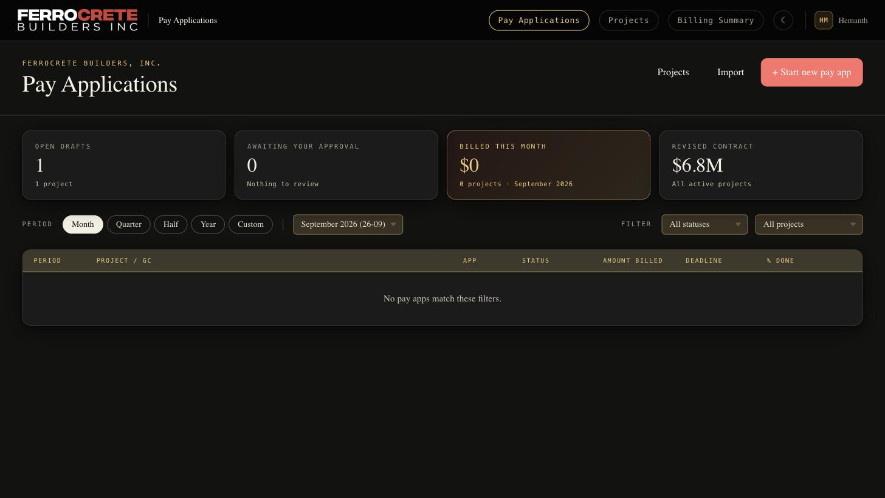

- **Open drafts** — pay apps still being prepared.
- **Awaiting your approval** — (admins) pay apps waiting for your sign-off.
- **Billed this month** — total billed for the selected period.
- **Revised contract** — total contract value across active projects.
- Use the **Period** buttons (Month / Quarter / Half / Year / Custom) and the
  **Filter** dropdowns to narrow the list.
- Top-right nav switches between **Pay Applications**, **Projects**, and **Billing Summary**.

---

## 2. Projects

Click **Projects** in the top nav to see all active projects. Each card shows the
project number, name, GC, contract value, and retention rate.

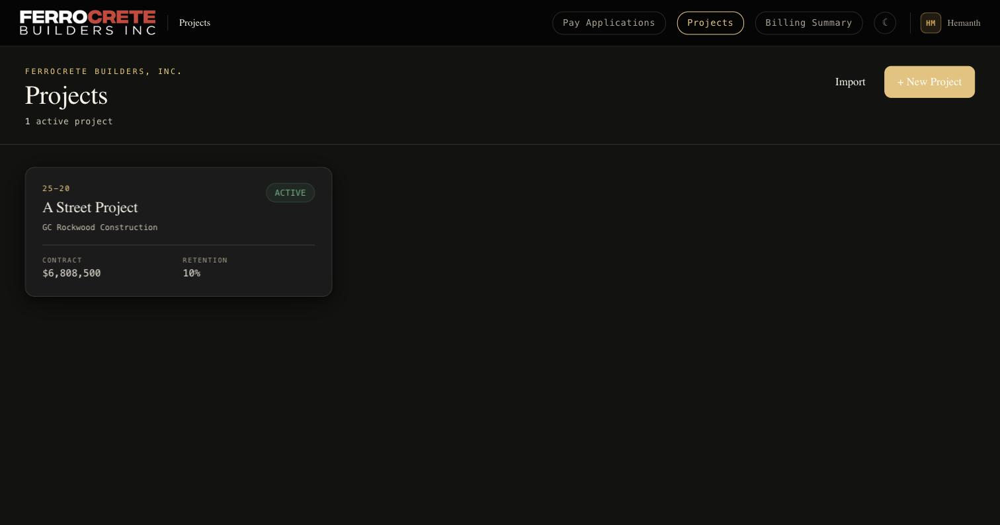

### 2a. Adding a project (via Excel import)

Manual project creation is not yet available — projects are created by **importing
an Excel pay-app file**. Click **+ New Project**; you'll be pointed to the import flow.

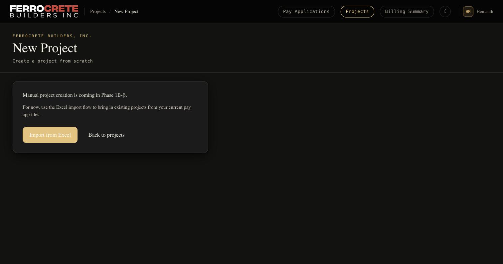

On **Import Project**, choose your AIA G702/G703 `.xlsx` file. Keep **"Also create
the pay app row"** checked to bring in that period's billings too. Click **Import**.
This creates the project, its SOV lines, and change orders in one step.

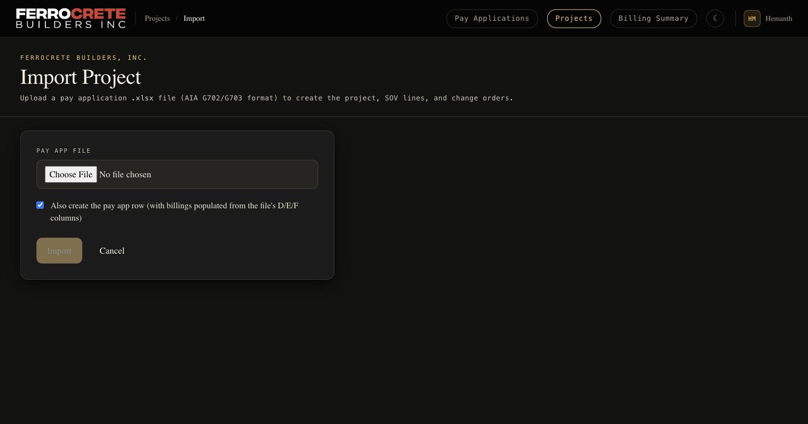

---

## 3. Inside a project

Click a project card to open it. You'll see the contract summary, the list of
**Pay Applications**, and **Change Orders**.

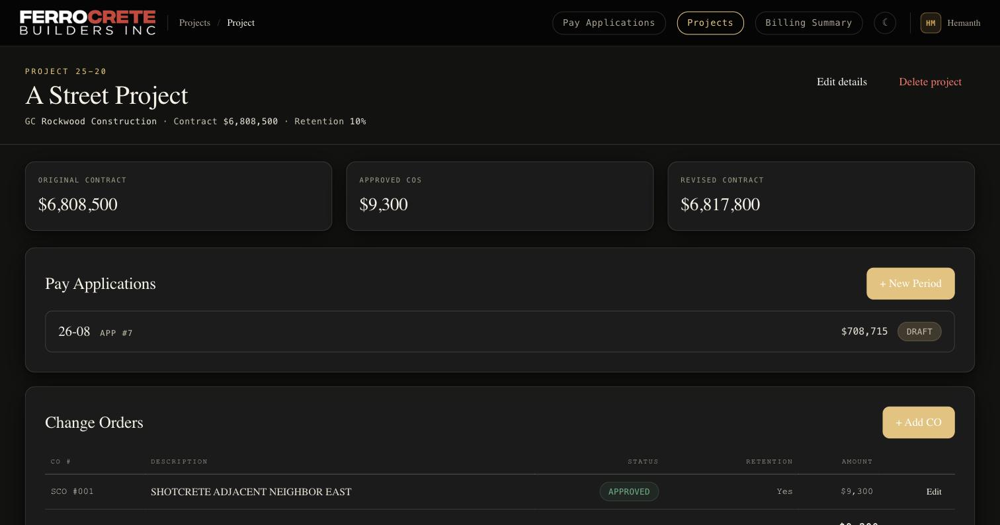

- **Original contract / Approved COs / Revised contract** cards at the top.
- **Pay Applications** — one row per period. **+ New Period** starts the next one.
- **Change Orders** — **+ Add CO**; only **Approved** COs affect billing.
- **Edit details** changes GC/contact info. **Delete project** (admins only) removes
  the project and purges its release trackers.

### 3a. Subs / Vendors

From the project, open **Subs**. These feed the release trackers. Add subs with
**+ Add top-level** (or **+ child** for sub-tiers). The **Non-Prelim Payments** row
is a built-in catch-all for vendors that were never prelimed.

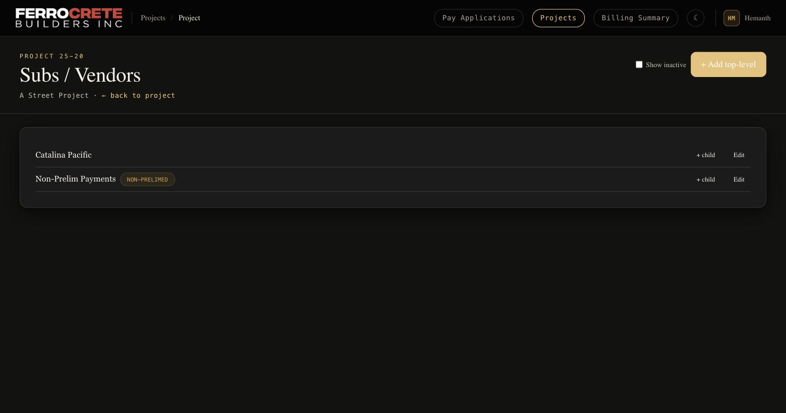

> **Tip:** add subs *before* you create release trackers, or trackers seed empty.

---

## 4. Creating and billing a pay application

Open a pay app (or start one with **+ New Period**). The billing screen has the
G703 line items on the left and a **live AIA G702 preview** on the right.

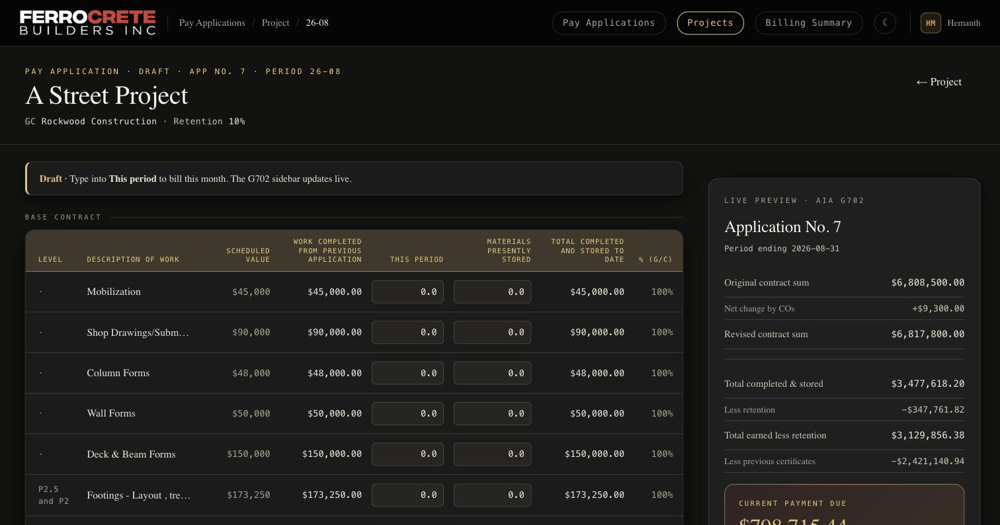

1. For each line, type this month's numbers into **THIS PERIOD** and **MATERIALS
   PRESENTLY STORED**. Everything else fills in automatically:
   - **Work completed from previous application** carries forward from last month.
   - **Total completed to date**, **% (G/C)**, retention, and **Current Payment Due**
     recalculate live in the right sidebar as you type.
2. The header shows the status (e.g. **DRAFT**) and application number.

### 4a. Actions on a pay app

Scroll the right sidebar for the action buttons.

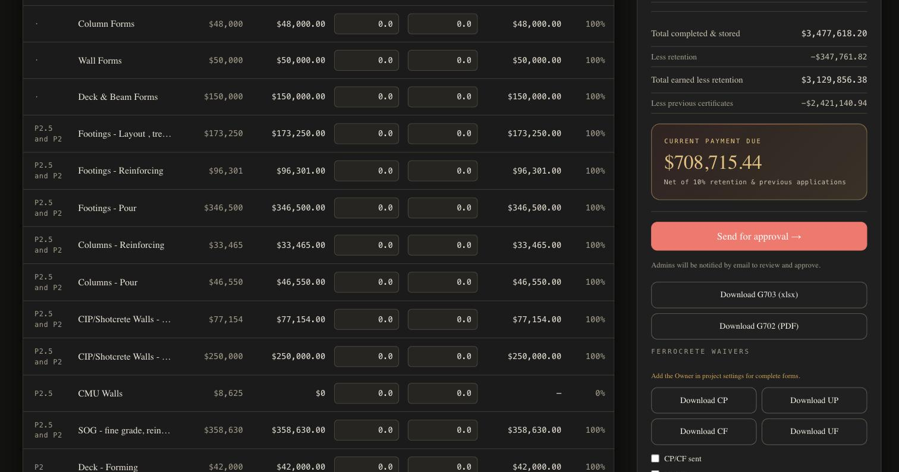

- **Current Payment Due** — the net check amount (after retention & prior billings).
- **Send for approval →** — submits the draft; **all admins are emailed** to review.
  *(Only click when the draft is final.)*
- **Download G703 (xlsx)** / **Download G702 (PDF)** — the AIA forms to send/file.
- **Ferrocrete Waivers** — generate CP / UP / CF / UF waiver forms. Add the Owner
  in project settings for complete forms.

### 4b. Approval flow (who does what)

| Step | Who | Result |
|------|-----|--------|
| **Send for approval** | accountant / admin | Draft → Pending approval; admins emailed |
| **Approve** | **admin only** | Pending → Approved; submitter emailed |
| **Reject** (with reason) | **admin only** | Back to draft; submitter emailed |
| **Send to GC** | accountant / admin | Approved → Submitted; GC emailed (if set) |
| **Mark paid** | accountant / admin | Submitted → Paid |

Undo options exist at each stage (Recall, Unapprove, Unsend).

---

## 5. Release trackers (lien waivers)

Each period has a **release tracker** that logs waiver status per sub. Open a
project's **Release Trackers**.

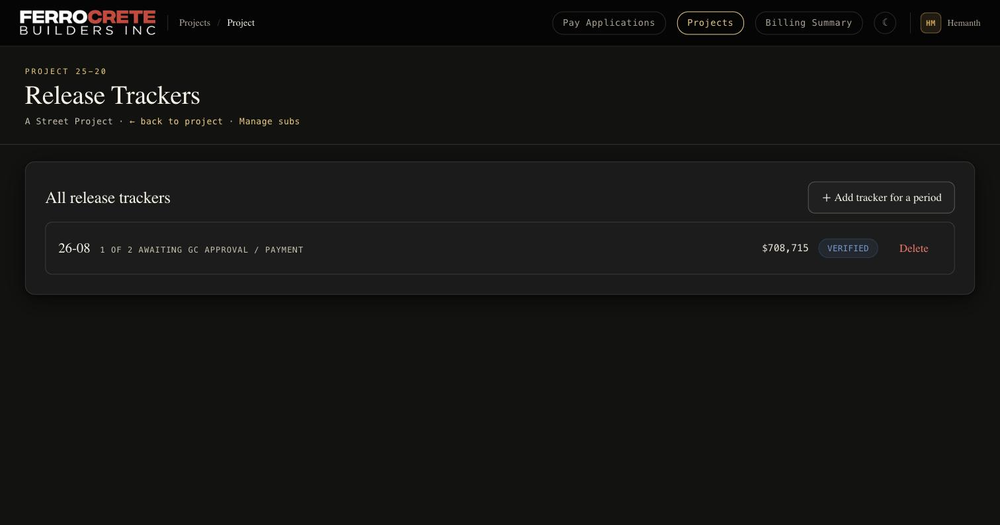

- One row per period, showing progress ("1 of 2 awaiting GC approval / payment"),
  invoice amount, and workflow status.
- **+ Add tracker for a period** — back-enter a tracker for any past period (e.g.
  historical data), even one with no pay app.
- **Delete** (admins only) — permanently removes a tracker.

### 5a. Working a tracker

Open a tracker to manage it.

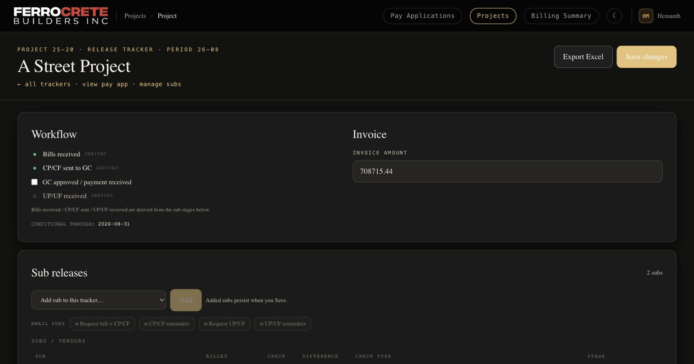

- **Workflow** checklist (top left) is derived from the sub rows below.
- **Invoice amount** carries from the pay app; editable.
- **Email subs** buttons send waiver requests and reminders (Request bill + CP/CF,
  CP/CF reminders, Request UP/UF, UP/UF reminders).
- **Export Excel** exports the tracker; **Save changes** saves your edits.

Scroll to the per-sub rows. Each sub has **Billed**, **Check**, **Difference**,
**Check Type**, and a **lifecycle stepper** (Bill → CP/CF → GC Pays → Paid Sub →
UP/UF). Fill these in each month — they are **not** auto-filled.

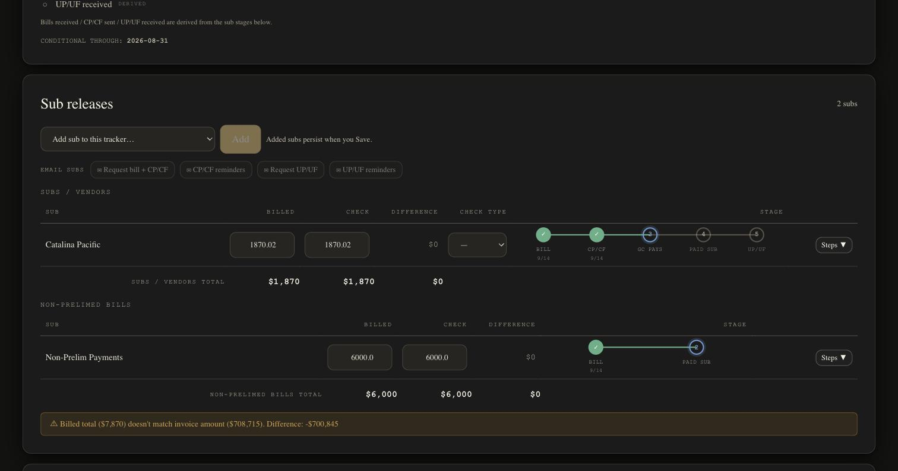

> A warning banner appears if the summed billed amounts don't match the invoice —
> a helpful check that you've entered every sub.

---

## 6. Billing Summary (monthly roll-up)

Click **Billing Summary** in the top nav for the company-wide monthly financials.

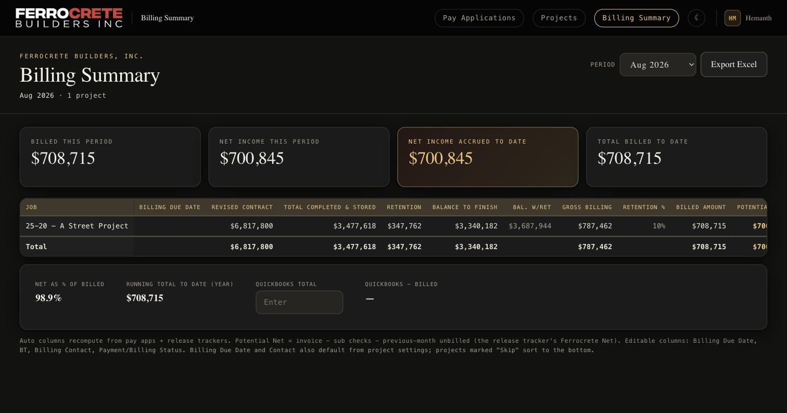

- Choose the **Period** (top right).
- Cards: **Billed this period**, **Net income this period**, **Net income accrued
  to date**, **Total billed to date**.
- The table lists each active project with revised contract, completed-to-date,
  retention, balances, gross billing, and billed amount. Editable columns include
  billing due date, contact, and payment status.
- Enter the **QuickBooks total** to reconcile against billed.
- **Export Excel** produces the summary sheet.

---

## 7. Monthly cheat-sheet

1. **Import / open** the project.
2. **Start new period** → enter this month's work on the pay app → check the G702 preview.
3. **Send for approval** (final draft) → admin **approves**.
4. **Download G702 PDF / G703 Excel**; **Send to GC**.
5. When paid, **Mark paid**.
6. Work the **release tracker**: enter billed/check per sub, advance each stepper,
   email waiver requests, upload/generate waivers.
7. Review **Billing Summary** and reconcile against QuickBooks.

---

*Screenshots current as of Aug 2026. If a button in this guide isn't visible to you,
your role may not permit that action — see PAY_APP_WORKFLOWS.md, Section 1.*
